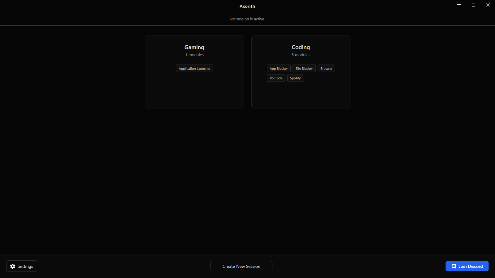
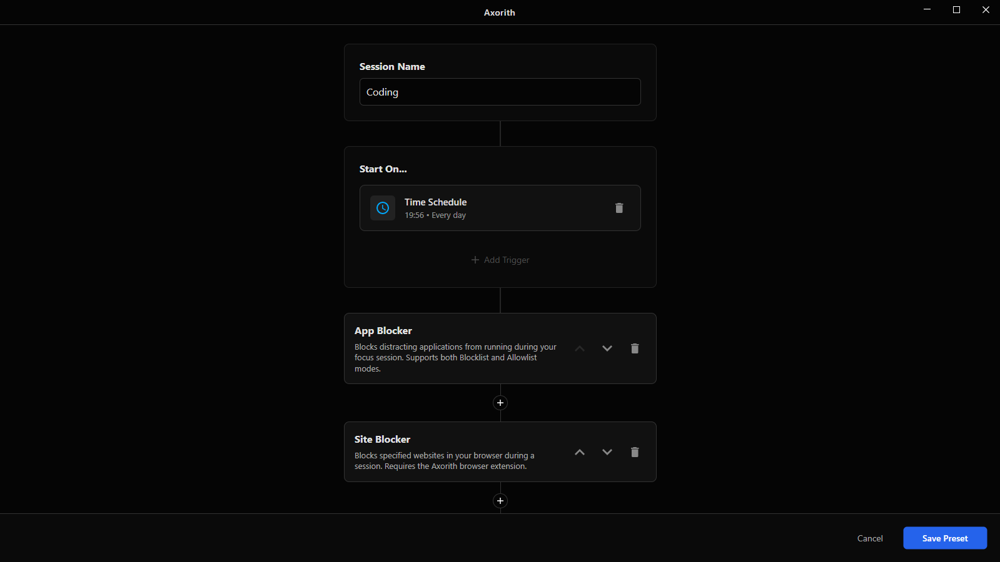
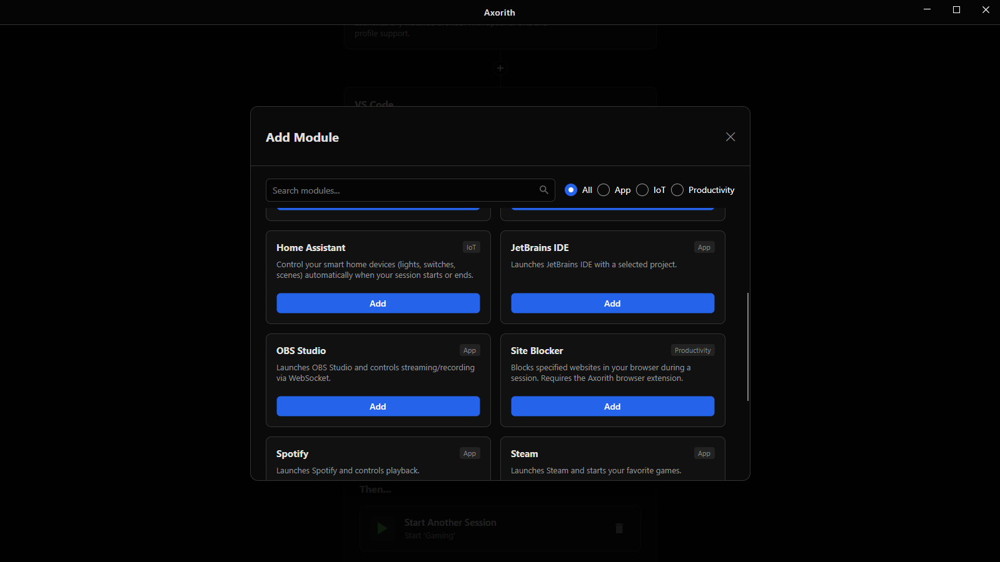
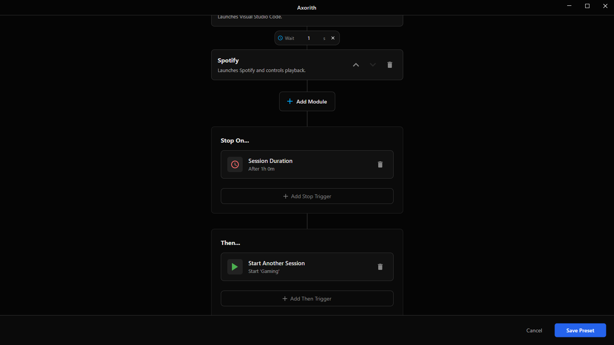



  
  

  

    
    
    
  

# Axorith: Local Workspace Orchestrator

**A free, local alternative to Freedom and Cold Turkey — with Home Assistant integration and a plugin system.**

I built Axorith because I was tired of the manual ritual every morning: closing Steam, opening VS Code, finding the right playlist, and toggling smart lights. Existing tools were either too simple (just app launchers) or required cloud subscriptions.

Axorith runs locally as a background service. It monitors your context and enforces rules: launching required tools, killing distractions, and triggering Home Assistant webhooks.

## Key Features

*   **Process Control:** Automatically launches work apps (VS Code, Docker) and terminates distractions (Steam, Discord) when a session starts.
*   **Home Assistant Integration:** Triggers scenes, scripts, or lights via local API. Your physical room adapts to your digital context.
*   **Hard Blocking:** Sites and apps are gone the moment your session starts — no way to accidentally open them mid-focus.
*   **Spotify Control:** Automates playback, volume, and device selection.
*   **Scheduler:** Cron-like scheduling to force context switches (e.g., "Work Mode" starts automatically at 9:00 AM).

## Screenshots
<table style="width: 100%;">
  <tr>
    <td></td>
    <td></td>
  </tr>
  <tr>
    <td></td>
    <td></td>
  </tr>
</table>

## Tech Stack

Built with modern .NET technologies, focusing on performance and modularity:

*   **Core:** .NET 10 & C# 14
*   **UI:** Avalonia UI (Cross-platform foundation) + ReactiveUI (MVVM)
*   **Communication:** gRPC (Protobuf) for inter-process communication.
*   **Logging:** Serilog (Structured logging).

## Architecture

Unlike typical monolithic desktop apps, Axorith uses a **Client-Server architecture** running locally on your machine:

1.  **Axorith.Host:** A headless background service (Worker). It holds the state, manages timers, runs the scheduler, and handles hardware integrations. If the UI crashes, your session and blockers **keep running**.
2.  **Axorith.Client:** A lightweight Avalonia UI that connects to the Host via gRPC.

### Plugin System
Modules are loaded into isolated `AssemblyLoadContexts`. This allows for:
*   Runtime loading/unloading of plugins.
*   Dependency isolation (Plugin A can use Newtonsoft.Json v12, Plugin B can use v13).
*   Prevention of memory leaks during development/hot-reload.

## Getting Started

### Installation
Download the latest installer from the [Releases page](https://github.com/axorithlabs/axorith/releases).
*   *Note: Windows SmartScreen may show a warning on first launch — this is expected for unsigned open-source installers. Source code is fully available for review.*

### Usage

1.  **Create a Session:** Click "Create New Session" and name it (e.g., "Deep Work").
2.  **Start On... (Triggers):**
    *   Add a **Time Schedule** (e.g., Mon-Fri at 09:00) to auto-start.
    *   Leave empty to start manually via the "Start" button.
3.  **Configure Modules:**
    *   Click **Add Module** to select tools from the library.
    *   *App Blocker:* Select categories (Gaming, Social) or specific exes to kill.
    *   *App Launcher:* Select `code.exe` and set your project path.
    *   *Home Assistant:* Enter your Entity ID (e.g., `scene.focus_mode`).
4.  **Stop On...:**
    *   Add a **Session Duration** trigger (e.g., 2 hours) to auto-stop the session.
5.  **Then... (Chaining):**
    *   Optionally select another preset (e.g., "Rest") to start automatically when this session ends.

## Roadmap

*   [x] **Core:** Client-Server gRPC architecture.
*   [x] **Modules:** App Blocker, Site Blocker, Spotify, Home Assistant, Steam, OBS.
*   [ ] **Platform:** Linux & macOS support (Core is ready, UI needs adjustments).
*   [ ] **Cloud:** Optional preset sync (Self-hosted or Cloud).

## Support Development

Axorith is free and open-source. I develop it in my spare time. If it helps you stay productive, consider supporting the development.

**Card (RUB):**
[**Support via CloudTips**](https://pay.cloudtips.ru/p/41eb7826)

  
<strong>Crypto (USDT, BTC, ETH, TON)</strong>

*   **BTC:** `bc1q4p93zvy3pxdf293hwka2tmdyhr53zwju3xmwlf`
*   **ETH / USDT / USDC (ERC-20):** `0xb1aec06166336cf717b244dbdc8620820824f1d7`
*   **TON:** `UQAMfKB_qmJZp2CpIJb6oxrqH4cqe81H2iZ4Mbq9wrR7mHn1`

## Contributing

This is an open-source project and I welcome contributions.
If you want to write a module (e.g., for Hue, Yeelight, or Slack), check out the `src/Sdk` project.

1.  Fork the repository.
2.  Create a feature branch.
3.  Submit a Pull Request.

**Found a bug?** [Open an Issue](https://github.com/axorithlabs/axorith/issues).
**Have an idea?** [Start a Discussion](https://github.com/axorithlabs/axorith/discussions).

## License

Source-available under the **Business Source License (BSL 1.1)**.
*   Free for personal use.
*   Free for non-commercial use.
*   See [LICENSE.md](LICENSE.md) for details.

## SAST Tools

[PVS-Studio](https://pvs-studio.com/en/pvs-studio/?utm_source=website&utm_medium=github&utm_campaign=open_source) - static analyzer for C, C++, C#, and Java code.
